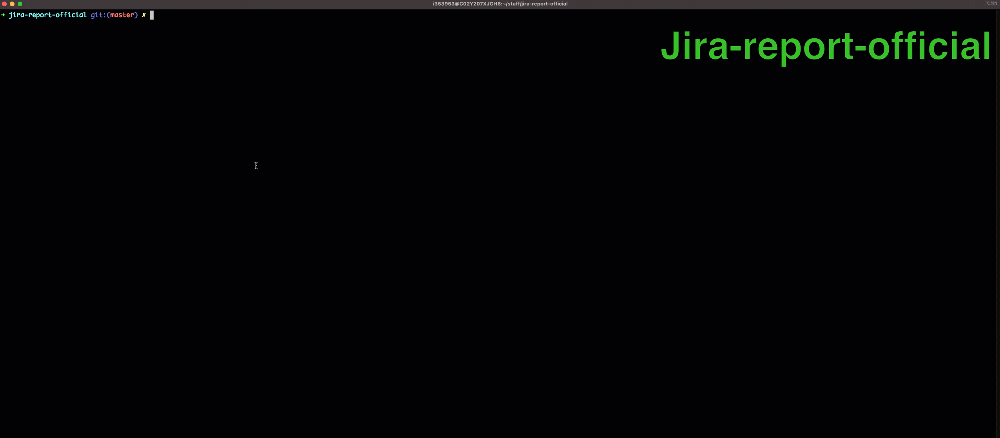

For any issues contact stenlytu@gmail.com. This script was tested on macOS Catalina and CentOS-7 with Python 3

# Automatic Jira report
The goal of this script is to automate creation of monthly report regarding issues reported in Jira.

All results are exported into Excel file.

The script is only relevant to Team-1 and Team-2.

To use it for other teams, some constraints need to be modified.

## Usage:

    python3 jira_report.py

## Installation and set up:

1. Clone the repo:
    ```
    git clone https://github.com/StenlyTU/jira-report-official.git
    ```

2. Make the script executable:
    ```
    cd jira-report-official
    chmod +x jira_report.py
    ```

3. Install all necessary Python packages from *requirements.txt* file:

    

    ```
    pip3 install -r requirements.txt
    ```

4. Enter your credentials in *credentials.ini* file:

    

5. Configure desired Jira queries in *configuration.ini* file:

    

### Python 3 Dependencies:

1. openpyxl
2. pandas
3. jira
4. xlrd